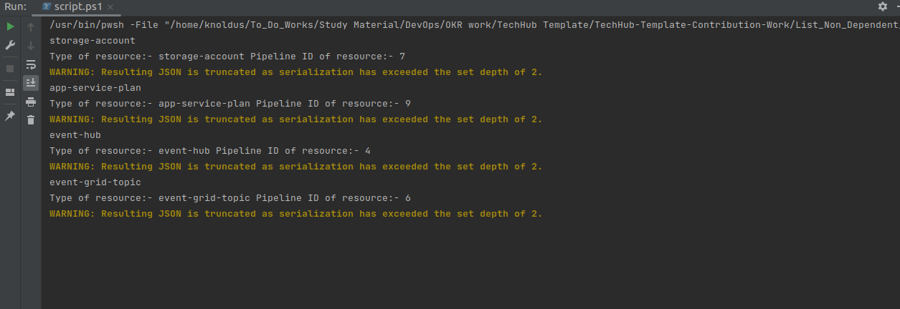
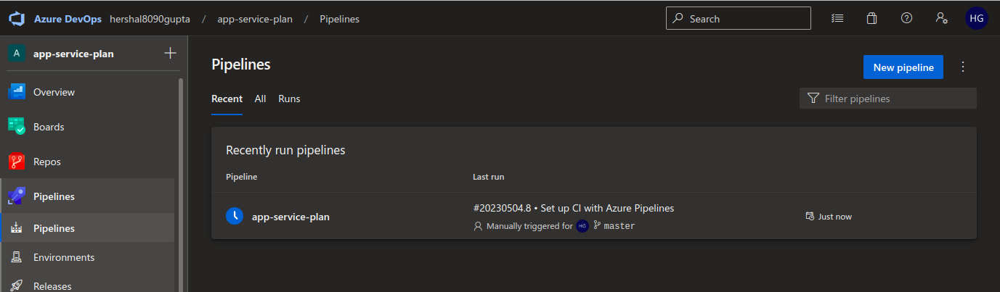
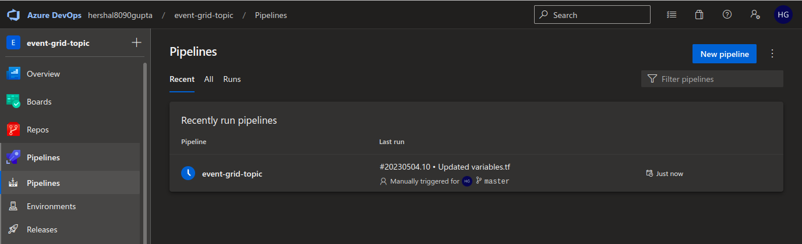
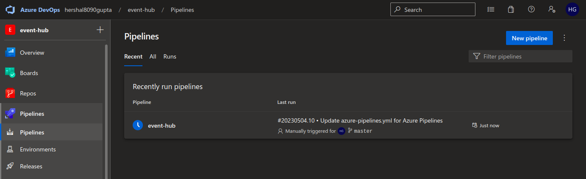
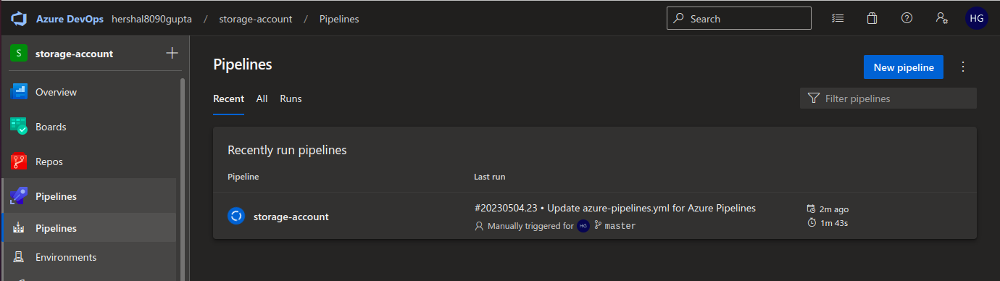

## Description

In this template, we will List the Non-dependent modules using the Depends On flag from the JSON and run the ADO pipeline.

---

### Steps

* Run the powershell script from any IDE or using `./<script-name>.ps1` in terminal.

* Start the Agent , to call ADO pipeline.

---

#### Notes

* We have used component json url file as [naas-component.json](naas-component.json)  that will be presented in our GitHub. 
* We have used pipeline id url file as [id.json](id.json) that will be presented in our GitHub.
---

### Outputs

1. Here, In this step, we are running the script :

2. Here, In this step, we are displaying the output of each pipeline's:

---